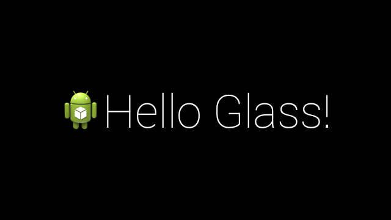
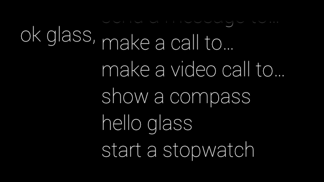

Hello Glass
===========

This application is a Hello World sample for Google Glass using the GDK.

- The application publishes a card to the users timeline which displays the text "Hello Glass!"

- The application can be launched by using the "hello glass" voice command

- This application also shows how to add menu options to the card

License
========

Copyright (C) 2015 OpenQuartz

Licensed under the Apache License, Version 2.0 (the "License"); you may not use this file except in compliance with the License. You may obtain a copy of the License at
 
  http://www.apache.org/licenses/LICENSE-2.0

Unless required by applicable law or agreed to in writing, software distributed under the License is distributed on an "AS IS" BASIS, WITHOUT WARRANTIES OR CONDITIONS OF ANY KIND, either express or implied. See the License for the specific language governing permissions and limitations under the License.
