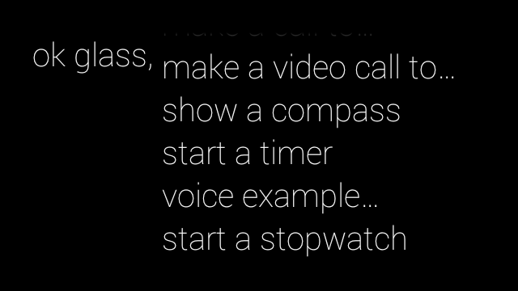

Voice Example
===========

This application is an example of how to get text from the voice recognition on the Google Glass using the GDK.

- The application publishes a card to the users timeline which displays what the user said

- The application can be launched by using the "voice example" voice command

- The user can then can talk and what they say will be recorded and transcribed to be used in the card

- If the the card is already published, the original text will simply be changed to the new text 

License
========

Copyright (C) 2014 OpenQuartz

Licensed under the Apache License, Version 2.0 (the "License"); you may not use this file except in compliance with the License. You may obtain a copy of the License at
 
  http://www.apache.org/licenses/LICENSE-2.0

Unless required by applicable law or agreed to in writing, software distributed under the License is distributed on an "AS IS" BASIS, WITHOUT WARRANTIES OR CONDITIONS OF ANY KIND, either express or implied. See the License for the specific language governing permissions and limitations under the License.
